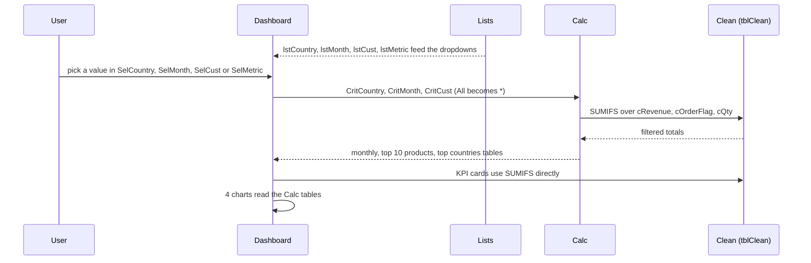

# Dashboard filter chain

What happens in the workbook when a dropdown on the Dashboard changes.

Sources: [build_workbook.py](../../scripts/build_workbook.py) (sections Lists, Calc, Dashboard)

```mermaid
sequenceDiagram
    participant U as User
    participant D as Dashboard
    participant L as Lists
    participant K as Calc
    participant T as Clean (tblClean)

    L-->>D: lstCountry, lstMonth, lstCust, lstMetric feed the dropdowns
    U->>D: pick a value in SelCountry, SelMonth, SelCust or SelMetric
    D->>K: CritCountry, CritMonth, CritCust (All becomes *)
    K->>T: SUMIFS over cRevenue, cOrderFlag, cQty
    T-->>K: filtered totals
    K-->>D: monthly, top 10 products, top countries tables
    D->>T: KPI cards use SUMIFS directly
    D->>D: 4 charts read the Calc tables
```
